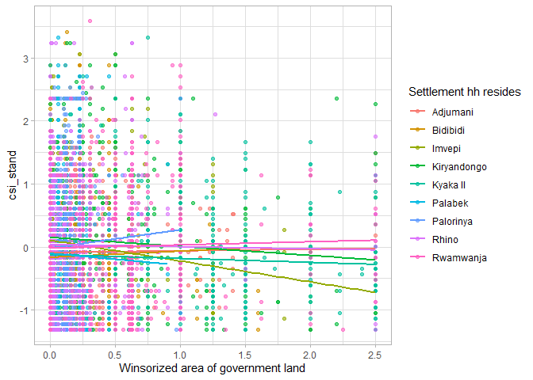
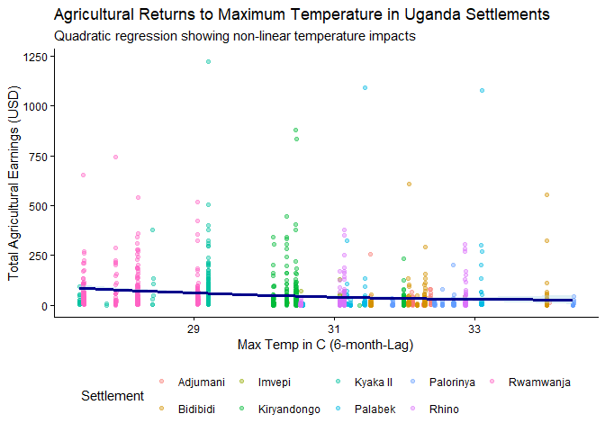
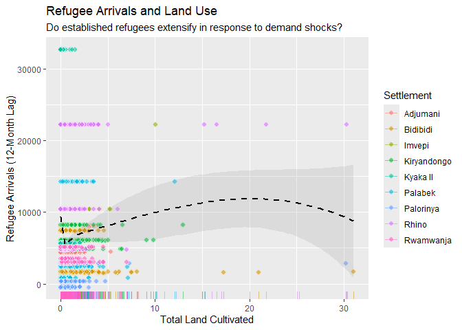
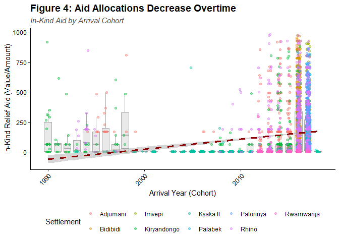

## Goal and requirements

The goal of this assignment is simple: Produce *four* different figures using **ggplot2**. They do not have to identify causal relationships. Rather, the goal is to stretch your visualization legs and demonstrate any new (or existing) **ggplot2** skills that you have acquired since our first lecture. 

Some additional points:

- You are free to use any dataset that comes built in with base R, or bundled together with an external R package. See [here](https://vincentarelbundock.github.io/Rdatasets/datasets.html) for a large list.

- That being said, I would especially encourage you to use your own data. 

- We have not gotten to data importation yet, but take a look [here](https://support.rstudio.com/hc/en-us/articles/218611977-Importing-Data-with-RStudio) if you need help. I would recommend that you install the **readr** and/or **readxl** packages and use a command like `my_data <- read_csv("my_data.csv")` or `my_data <- read_excel("my_data.xlsx")`.

- You can use the same dataset for all four of your plots. Or you can use a new dataset for each plot. Regardless of what you choose, I want you to try to use different geoms for each figure. There is a great list of geoms on the **ggplot2** cheatsheet [here](https://rstudio.github.io/cheatsheets/html/data-visualization.html) (check out the PDF!).

- Any other **ggplot2** skills and add-ons like faceting, changing aesthetic scales or legends, using different themes (e.g. from the **ggthemes** package), animation, etc. are all welcome and encouraged.

- I want to *see* the code that produces the figures. (Do not use `echo=FALSE` in any of the code chunks, if that means anything to you.)

- To submit this assignment, create a repo on your GitHub account so that I can clone it. Organize your data into a `data/` folder and your code into a `scripts/` or `code/` folder. 

### What you will be graded on

- Are your figures clear? (E.g. lack of chart chunk, non-overlapping labels.)
- Are your figures compelling? (E.g. use an appropriate geom for the insight that you want to convey.)
- Variation. (Do not create four line charts of the same dataset. Be creative).
- Did you read and follow the instructions of this assignment? (E.g. describe your data and figures, show the code that produces the figures, include data in the `/data` folder, etc.)
- Etc.

Lastly, do not forget to knit the assignment (click the "Knit" button, or press `Ctrl+Shift+K`) before submitting. 

## Start the assignment


``` r
pacman::p_load(ggplot2, here, haven, dplyr, ggthemes, tidyr, knitr)
```


``` r
my_data <- haven::read_dta(here("data", "Analysis.dta"))
my_data <- haven::as_factor(my_data)
```

This data is the Resilience Index Measurement and Analysis survey from 2017-2021. The data is sourced from the UN's FAO and covers food security, production, aid and general resilience measures for both host and established refugee households living in and around settlement communities. This specific dataset only includes Refugee households.

### Figure 1: Land Allocations and Food Security, by Refugee Settlement.


``` r
ggplot(data = my_data, aes(x = wingovland, y = csi_stand, color = settlement)) + 
  geom_point(alpha = 0.6) + 
  geom_smooth(method = "lm", se = FALSE) +
  theme_light()
```

```
## `geom_smooth()` using formula = 'y ~ x'
```

```
## Warning: Removed 6 rows containing non-finite outside the scale range
## (`stat_smooth()`).
```

```
## Warning: Removed 6 rows containing missing values or values outside the scale range
## (`geom_point()`).
```

<!-- -->


This data shows the relationship between standardized coping strategies (indicators for food insecurity, higher is worse) and the amount of land refugee households are allocated, by settlement.

The data shows diverging baseline trends across settlements, with some showing positive and negative relationships between land allocation and food security.


### Figure 2: Agricultural Harvests and Temp, Nonlinear by Settlement


``` r
ggplot(data = my_data, aes(x = high_temp_6, y = totagearned_usd)) +
  geom_jitter(aes(color = settlement), alpha = 0.4, size = 1.5) +
  geom_smooth(
    method = "lm", 
    formula = y ~ x + I(x^2), 
    color = "darkblue", 
    fill = "lightblue", 
    linewidth = 1.2
  ) +
  labs(
    x = "Max Temp in C (6-month-Lag)",
    y = "Total Agricultural Earnings (USD)",
    title = "Agricultural Returns to Maximum Temperature in Uganda Settlements",
    subtitle = "Quadratic regression showing non-linear temperature impacts",
    color = "Settlement"
  ) +
  theme_classic() +
  theme(legend.position = "bottom")
```

```
## Warning: Removed 3929 rows containing non-finite outside the scale range
## (`stat_smooth()`).
```

```
## Warning: Removed 3929 rows containing missing values or values outside the scale range
## (`geom_point()`).
```

<!-- -->

The data shows decreasing earnings in response to daily maximum temperature increases.

### Figure 3: Refugee Arrivals and Land Use: Do Established Refugees Extensify in Response to Demand Shocks?


``` r
ggplot(data = my_data, aes(x = totlanduse, y = chref_12)) +
  geom_rug(aes(color = settlement), alpha = 0.5, sides = "b") +
  geom_jitter(aes(fill = settlement), shape = 21, color = "white", size = 2.5, alpha = 0.6) +
  geom_smooth(
    method = "loess", 
    color = "black", 
    linewidth = 1, 
    linetype = "dashed", 
    se = TRUE, 
    alpha = 0.2
  ) +
  labs(
    x = "Total Land Cultivated",
    y = "Refugee Arrivals (12-Month Lag)",
    title = "Refugee Arrivals and Land Use",
    subtitle = "Do established refugees extensify in response to demand shocks?",
    fill = "Settlement",
    color = "Settlement"
  ) 
```

```
## `geom_smooth()` using formula = 'y ~ x'
```

```
## Warning: Removed 2231 rows containing non-finite outside the scale range
## (`stat_smooth()`).
```

```
## Warning: Removed 217 rows containing missing values or values outside the scale range
## (`geom_rug()`).
```

```
## Warning: Removed 2231 rows containing missing values or values outside the scale range
## (`geom_point()`).
```

<!-- -->

The basis for one of my chapters is seeing the land use responses from refugee arrivals. Using the loess function, we see a non-linear response between arrivals and land under cultivation at the household level.

### Figure 4: Aid Allocations Decrease Overtime: In-Kind Aid by Arrival Cohort. 


``` r
ggplot(data = my_data, aes(x = arrivalyear, y = relief_aid_usd)) +
  geom_boxplot(aes(group = arrivalyear), fill = "lightgray", color = "darkgray", alpha = 0.5, outlier.shape = NA) +
  geom_jitter(aes(color = settlement), width = 0.2, alpha = 0.4, size = 1.5) +
  geom_smooth(method = "lm", color = "darkred", linewidth = 1.2, linetype = "dashed", se = TRUE) +
  labs(
    title = "Figure 4: Aid Allocations Decrease Overtime",
    subtitle = "In-Kind Aid by Arrival Cohort",
    x = "Arrival Year (Cohort)",
    y = "In-Kind Relief Aid (Value/Amount)",
    color = "Settlement"
  ) +
  theme_classic() +
  theme(
    plot.title = element_text(face = "bold", size = 14),
    plot.subtitle = element_text(face = "italic", color = "gray30"),
    legend.position = "bottom",
    axis.text.x = element_text(angle = 45, hjust = 1)
  )
```

```
## `geom_smooth()` using formula = 'y ~ x'
```

<!-- -->

This plot is the most over the top of the four and again stems from the motivation for one of my chapters. The constrained funding environment has led to refugees receiving less direct aid allocations as their tenure in the settlement increases.
